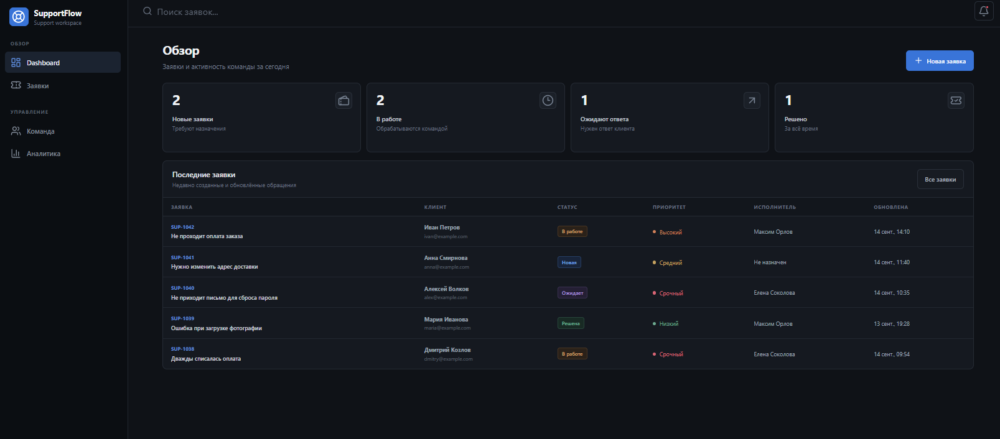
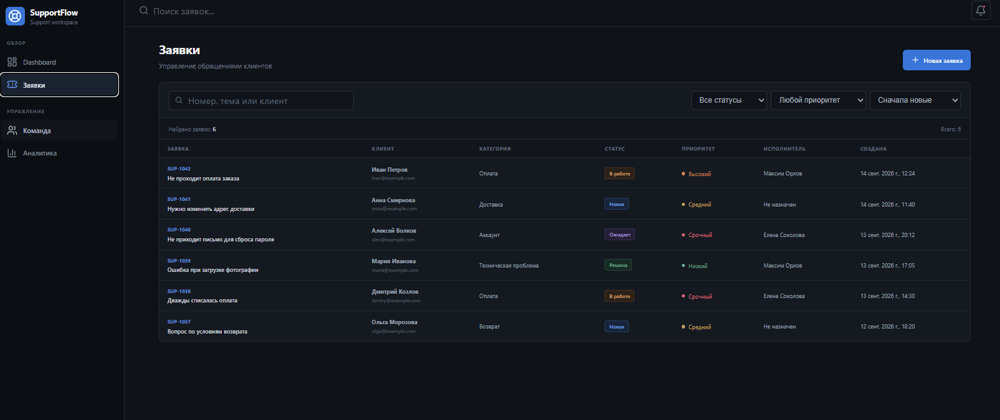
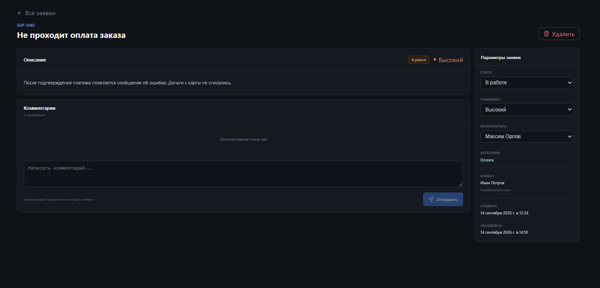
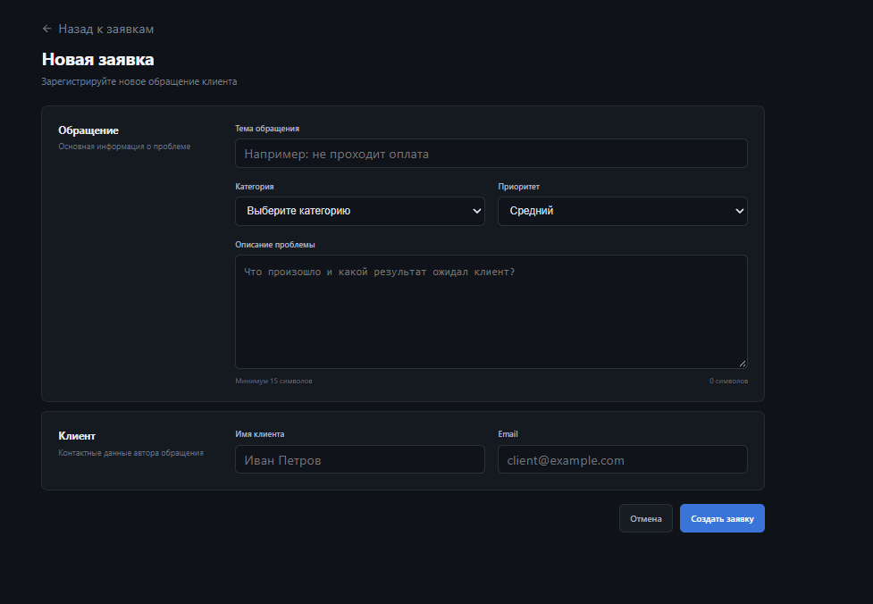
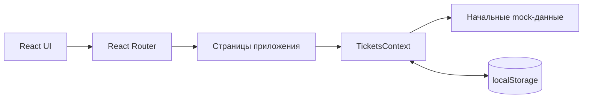

# SupportFlow

<div align="center">
  <p><strong>Интерфейс службы поддержки для работы с обращениями клиентов</strong></p>

  <p>
    
    
    
    
    
  </p>
</div>



## О проекте

**SupportFlow** — frontend-концепт внутренней help desk-системы для обработки обращений клиентов.

Оператор видит состояние очереди, создаёт новые заявки, использует поиск и фильтры, назначает исполнителей, изменяет параметры обращений и ведёт внутреннее обсуждение.

Проект построен вокруг законченного пользовательского сценария:

```text
Dashboard → список заявок → создание → карточка → обработка → комментарии
```

> Сейчас SupportFlow представляет собой самостоятельный frontend MVP. Данные сохраняются в браузере через `localStorage`, а серверная часть вынесена в roadmap.

## Возможности

* обзор очереди и динамические счётчики по статусам;
* отображение последних обращений на Dashboard;
* поиск по номеру, теме, имени и email клиента;
* фильтрация заявок по статусу и приоритету;
* сортировка по дате создания и важности;
* создание заявки с проверкой обязательных полей;
* отдельная страница каждого обращения;
* изменение статуса, приоритета и исполнителя;
* добавление внутренних комментариев;
* удаление заявки с подтверждением;
* автоматическое обновление статистики;
* сохранение изменений после перезагрузки страницы;
* состояния пустой выдачи и ошибок валидации;
* адаптивная вёрстка для узких экранов.

## Интерфейс

### Реестр заявок

Поиск и фильтры пересчитывают таблицу на клиенте. Основные параметры обращения видны без перехода в его карточку.



### Карточка обращения

Оператор может прочитать описание проблемы, изменить рабочие параметры, назначить ответственного, добавить внутренний комментарий или удалить заявку.



### Создание заявки

Форма разделена на сведения об обращении и контактные данные клиента. Перед сохранением выполняется клиентская валидация.



## Как это работает



* `React Router` отвечает за переходы между Dashboard, списком, формой создания и карточкой заявки.
* `TicketsContext` хранит единое состояние и предоставляет операции для работы с обращениями.
* Счётчики Dashboard автоматически вычисляются из актуального массива заявок.
* Поиск, фильтрация и сортировка работают с производным состоянием.
* TypeScript ограничивает допустимые значения статусов и приоритетов.
* `localStorage` имитирует постоянное хранилище без backend API.

## Стек

| Технология     | Для чего используется                            |
| -------------- | ------------------------------------------------ |
| React 19       | Компоненты, состояние и интерактивный интерфейс  |
| TypeScript     | Типизация заявок, форм, статусов и приоритетов   |
| React Router 7 | Маршрутизация между страницами                   |
| Vite 8         | Dev-сервер и production-сборка                   |
| Lucide React   | SVG-иконки интерфейса                            |
| CSS            | Тёмная адаптивная UI-система без готового UI-kit |
| ESLint         | Статический анализ кода                          |
| localStorage   | Сохранение пользовательских изменений            |

## Структура проекта

```text
src/
├── context/
│   └── TicketsContext.tsx       # состояние и действия с заявками
├── data/
│   └── mockTickets.ts           # начальные данные
├── layouts/
│   └── AppLayout.tsx            # sidebar и основной layout
├── pages/
│   ├── DashboardPage.tsx        # статистика и последние заявки
│   ├── TicketsPage.tsx          # поиск, фильтры и сортировка
│   ├── CreateTicketPage.tsx     # форма создания
│   └── TicketDetailsPage.tsx    # обработка конкретной заявки
├── types/
│   └── ticket.ts                # доменные TypeScript-типы
├── App.tsx                      # маршруты приложения
├── App.css                      # стили компонентов и страниц
├── index.css                    # глобальные стили
└── main.tsx                     # точка входа
```

## Запуск локально

Для запуска понадобится Node.js версии `20.19` или новее.

```bash
git clone https://github.com/MaksimLAskov/supportflow.git
cd supportflow
npm install
npm run dev
```

После запуска Vite выведет локальный адрес приложения:

```text
http://localhost:5173
```

## Команды

| Команда           | Назначение                                       |
| ----------------- | ------------------------------------------------ |
| `npm run dev`     | Запустить режим разработки                       |
| `npm run build`   | Проверить TypeScript и собрать production-версию |
| `npm run preview` | Просмотреть production-сборку локально           |
| `npm run lint`    | Запустить ESLint                                 |

## Основные технические решения

### Единое состояние

Все страницы используют общий `TicketsContext`. Благодаря этому изменения статуса, исполнителя или приоритета сразу отображаются в таблице и статистике Dashboard.

### Типизация предметной области

Статусы и приоритеты описаны через union types:

```ts
type TicketStatus =
  | 'new'
  | 'in_progress'
  | 'waiting'
  | 'resolved'

type TicketPriority =
  | 'low'
  | 'medium'
  | 'high'
  | 'urgent'
```

TypeScript не позволяет записать в заявку случайное или неподдерживаемое значение.

### Сохранение данных

При каждом изменении массив заявок записывается в `localStorage`. После обновления страницы созданные обращения, комментарии и изменения параметров сохраняются.

### Производное состояние

Статистика, результаты поиска и отфильтрованные списки не хранятся отдельно, а вычисляются из основного массива заявок. Это уменьшает вероятность рассинхронизации данных.

## Roadmap

* [ ] REST API на Node.js и Express;
* [ ] PostgreSQL вместо локального хранилища;
* [ ] авторизация и роли `user / support / admin`;
* [ ] серверная валидация;
* [ ] серверная пагинация, поиск и фильтрация;
* [ ] TanStack Query для серверного состояния;
* [ ] тесты на Vitest и React Testing Library;
* [ ] CI-проверки через GitHub Actions;
* [ ] публичный деплой.

## Автор

**Максим Ласков** — frontend-разработчик.

[GitHub](https://github.com/MaksimLAskov)
